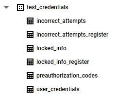

# StUser

**User registration, login and associated ecosystem for Streamlit**

## Installation

StUser can be installed via pip from [PyPI](https://pypi.org/project/stuser/):

```python
pip install stuser
```

## Full Example

StUser is a package that allows you to create a user registration and
login system for your Streamlit application. It is meant to be a robust
way to allow users to interact with your website securely. It has
pre-defined integrations for databases and email, and specifically defines
methods for use with GCP BigQuery and SendGrid, respectively.

### Understand Your Options

- Will you require users to be preauthorized before they can sign up? This
  is useful if you want to control who can access your application.
- Do you want users to validate their email address upon registration?
  This helps make sure the user actually has access to the email they
  are using.
- Will you lock users out after a certain number of failed login
  attempts? This is a security feature to prevent brute force attacks.

### Define User Info Storage

The first step is to define where the user info will be stored. You can
define your own storage locations and methods, but if using the
predefined BigQuery option, your dataset and tables can look like this:


This assumes that you are using all of the options available
(preauthorization, email validation, and lockout after failed attempts).
The name of the dataset and tables can vary and you can incorporate tables
into different datasets if you like, but the type of info you will store
should be the same. The _register tables are for registering when a
preauthorization code is required.

Table columns:
- incorrect_attempts:
  - username: STRING
  - datetime: DATETIME
- incorrect_attempts_register:
  - email: STRING
  - datetime: DATETIME
- locked_info:
  - username: STRING
  - locked_time: DATETIME
  - unlocked_time: DATETIME
- locked_info_register:
  - email: STRING
  - locked_time: DATETIME
- preauthorization_codes:
  - email: STRING
  - code: STRING
- user_credentials:
  - username: STRING
  - email: STRING
  - password: STRING
  - datetime: DATETIME
  - email_code: STRING
  - email_verified: BOOLEAN

### Error Handling

The package is designed to handle known errors by saving them to
session states (st.session_state). It will categorize the error as either
'user_errors' or 'dev_errors'. These categories are dictionaries where
the set of keys are the form names (such as 'login') and the values are 
the error messages. You can access these errors by using the following
syntax:

```python
from stuser import ErrorHandling as sterr
sterr.display_error('dev_errors', 'login')
```

### Send Preauthorization Codes

If preauthorization is required, you will need to send the preauthorized
users an email with a code that they can use to register. That way someone
cannot just brute force attempt to register with emails they think would
work. This function sends an email with the code and saves the email/code
combo to a database. It should be run separately from your streamlit app.

Verification is the class that handles the verification process, both the
preauthorization codes and email verification.

```python
verifier = stuser.Verification()
verifier.preauthorization_code(
    # you can have multiple emails at the same time
    email=["test_user1@gmail.com",
           "test_user2@gmail.com"],
    code_store_function='bigquery',
    # bq_creds should be a dictionary with the credentials
    # the fields are: type, project_id, private_key_id, private_key,
    # client_email, client_id, auth_uri, token_uri,
    # auth_provider_x509_cert_url, client_x509_cert_url and
    # universe_domain
    code_store_args={
        'bq_creds': bq_creds,
        'project': project, # project name (string)
        'dataset': 'test_credentials', # whatever you called your dataset
        'table_name': 'preauthorization_codes', # whatever you called your table
        'email_col': 'email', # whatever you called your email column
        'code_col': 'code'}, # whatever you called your code column
    email_function='sendgrid',
    # the email_inputs are used in the email body to let the user
    # know where the email is coming from
    email_inputs={
        'website_name': 'PyPI',
        'website_email': 'hello@pypi.com'},
    # you will need to have registered with SendGrid and have an API
    # key to use this - the key is a string
    email_creds={'sendgrid_api_key': sendgrid_api_key})
```

### Pull Existing Users, Emails and Preauthorized Users

The existing usernames and emails are used to make sure that a new user
is not trying to register with a username or email that already exists.
The preauthorized users are used to make sure that only certain users
can register. Preauthorization is optional.

The existing usernames and emails must be loaded as lists to session
states, as that is how they are accessed by the package. It allows these
session states to be updated once a new user is added, so that subsequent
adds will take into account the new users. The preauthorized users are
also loaded as a list to a session state, since they can then be removed
once the user has registered.

Below, we rely on the BQTools class to pull the usernames. This class is
used internally in the package, but can be useful for pulling BigQuery
data in general.

```python
import streamlit as st

import stuser

db_engine = stuser.BQTools()
usernames_indicator, saved_auth_usernames = (
    db_engine.pull_full_column_bigquery(
        # bq_creds should be a dictionary with the credentials
        # the fields are: type, project_id, private_key_id, private_key,
        # client_email, client_id, auth_uri, token_uri,
        # auth_provider_x509_cert_url, client_x509_cert_url and
        # universe_domain
        bq_creds = bq_creds,
        project = project, # project name (string)
        dataset = 'test_credentials', # whatever you called your dataset
        table_name = 'user_credentials', # whatever you called your table
        target_col = 'username')) # whatever you called your username column
if usernames_indicator == 'dev_errors':
    st.error(saved_auth_usernames)
    auth_usernames = []
elif usernames_indicator == 'user_errors':
    st.error("No usernames found")
    auth_usernames = []
else:
    auth_usernames = list(saved_auth_usernames.values)
    if 'stuser_usernames' not in st.session_state:
        st.session_state['stuser_usernames'] = auth_usernames
```

The same pattern can be used to pull the emails and preauthorized users.

### Define the Forms Object

Now that all the pre-work is done, we can instantiate the Forms.

```python
try:
  stuser_forms = stuser.Forms(
    # the usernames, emails and preauthorized session state names
    # should match those used above
    usernames_session_state='stuser_usernames',
    emails_session_state='stuser_emails',
    user_credentials_session_state='stuser_user_credentials',
    preauthorized_session_state='stuser_preauthorized',
    # the email and save_pull inputs can be input here to reduce the
    # number of arguments needed in the widgets. this can only be done
    # if using a predefined type (sendgrid and/or bigquery).
    # as long as the email and save_pull inputs are the same
    # throughout, they will not need to be repeated.
    # however, some additional inputs may be needed in the individual
    # widgets.
    # for example, we don't have the table or columns defined in
    # save_pull_args since those usually vary by widget.
    # note that if any arguments are entered here and in the widgets,
    # those in the widgets will override these.
    email_function='sendgrid',
    # the email_inputs are used in the email body to let the user
    # know where the email is coming from
    email_inputs={
      'website_name': 'PyPI',
      'website_email': 'hello@pypi.com'},
    # you will need to have registered with SendGrid and have an API
    # key to use this - the key is a string
    email_creds={'sendgrid_api_key': sendgrid_api_key},
    save_pull_function='bigquery',
    save_pull_args={
      # bq_creds should be a dictionary with the credentials
      # the fields are: type, project_id, private_key_id, private_key,
      # client_email, client_id, auth_uri, token_uri,
      # auth_provider_x509_cert_url, client_x509_cert_url and
      # universe_domain
      'bq_creds': bq_creds,
      'project': project,  # project name (string)
      'dataset': 'test_credentials'})  # whatever you called your dataset
except ValueError as e:
  # there are only dev errors for class instantiation and they
  # wouldn't need to show up ahead of time, just if they occur
  # during instantiation
  sterr.display_error('dev_errors', 'class_instantiation')
  st.stop()
```

### Create a User Registration Form

Now that the Forms object is created, we can use it to create the user
registration form.

```python
# for forms, the errors might be displayed after the form is submitted
# and we want them above the form
sterr.display_error('dev_errors', 'register_user')
sterr.display_error('user_errors', 'register_user')

# some of the arguments for bigquery methods will be the same
# these are just the necessary arguments that were not defined in the
# save_pull_args in the class instantiation
all_locked_args_register_user = {
    'table_name': 'locked_info_register', # whatever you called your table
    'email_col': 'email', # whatever you called your email column
    'locked_time_col': 'locked_time'} # whatever you called your locked time column
all_incorrect_attempts_args_register_user = {
    'table_name': 'incorrect_attempts_register', # whatever you called your table
    'email_col': 'email', # whatever you called your email column
    'datetime_col': 'datetime'} # whatever you called your datetime column

# most of the arguments were already passed to the class instantiation
stuser_forms.register_user(
    'main',
    preauthorization=True,
    verify_email=True,
    # the verification url is where the user will be sent to verify their
    # email address
    # we only need this for the email section since the rest was defined
    # in the class instantiation
    email_inputs={'verification_url':
                    'https://teststuser.streamlit.app/EmailVerification'},
    # this is the same as the save_pull_args in the class instantiation,
    # but we need to add the table name
    cred_save_args={'table_name': 'user_credentials'},
    # this is the same as the save_pull_args in the class instantiation,
    # but we need to add the table name and columns
    auth_code_pull_args={
        'table_name': 'preauthorization_codes',
        'email_col': 'email',
        'auth_code_col': 'code'},
    incorrect_attempts=10,
    locked_hours=24,
    # this assumes that all of the locking type functions have the same
    # arguments, but there are other arguments that can be passed in
    # if you want different saving or pulling functions during the locking
    # process - the same is true for the incorrect attempts process
    all_locked_args=all_locked_args_register_user,
    all_incorrect_attempts_args=all_incorrect_attempts_args_register_user)

# the final input here (False) lets the function know that it is not the
# first time this error is potentially being displayed (since some are
# displayed before the form is submitted), so it will not re-show an
# already displayed error here
sterr.display_error('dev_errors', 'register_user', False)
sterr.display_error('user_errors', 'register_user', False)
```
